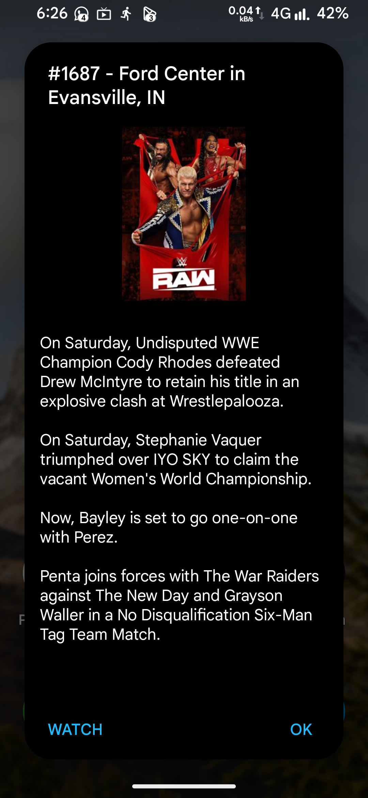

  

# Show Tracker
A tasker project to track new episodes.

Released: May 30, 2022

 
 

## 🚀 Get Started
1.  **Install Tasker** from the Google Play Store.
2.  Click the **"Import Taskernet"** badge above.
3.  Follow the setup instructions to add your shows.

> 💡 **Tip:** For reliable notifications, ensure tasker has notification permission and is excluded from battery optimizations.

## ✨ Features
* **Automatic Tracking**: Automatically checks for new episodes.
* **Instant Notifications**: Get an alert as soon as a new episode is released.
* **Wide Support**: Tracks most shows and anime.

## 📸 Screenshots

<table width="100%">
  <tr>
    <td width="10%" align="center" valign="top">
       Search matches
    </td>
    <td width="10%" align="center" valign="top">
       Show info
    </td>
    <td width="10%" align="center" valign="top">
       Reminder
    </td>
    <td width="10%" align="center" valign="top">
       Reminder (collapsed)
    </td>
    <td width="10%" align="center" valign="top">
       Providers
    </td>
    <td width="10%" align="center" valign="top">
       Next episode info
    </td>
    <td width="10%" align="center" valign="top">
       Episode summary
    </td>
    <td width="10%" align="center" valign="top">
       Widget
    </td>
    <td width="10%" align="center" valign="top">
       Widget (resized)
    </td>
    <td width="10%" align="center" valign="top">
       Manage shows
    </td>
  </tr>
</table>

## 📝 Credits
* [TV Maze](https://www.tvmaze.com/): Show data
* [TMDB](https://www.themoviedb.org/): Providers
* [anuraag488](https://github.com/anuraag488): Advanced notification
* [Mr_G0OD](https://t.me/@Mr_G0OD): Testing

## ❓ FAQ
* **Why am I not getting notifications?** 
Check Tasker's battery optimization and notification access settings.
* **Can I download episodes?** 
No, this project is for tracking and notifications only.

## 🤝 Contributing
Found a bug or have an idea? Open an issue!
